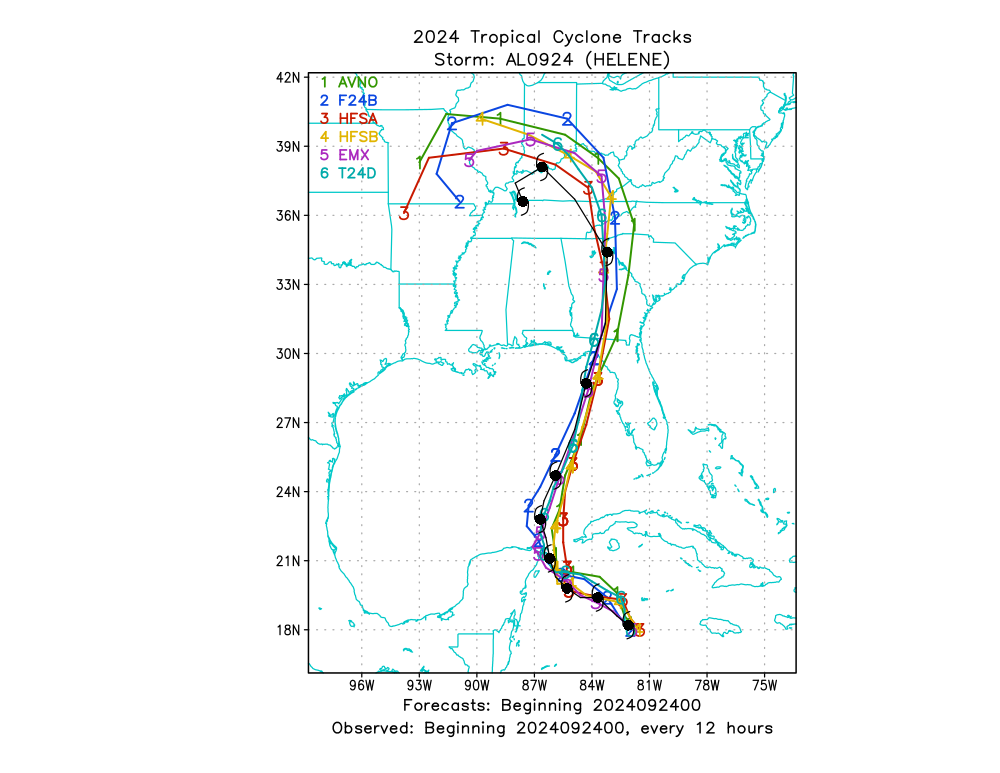
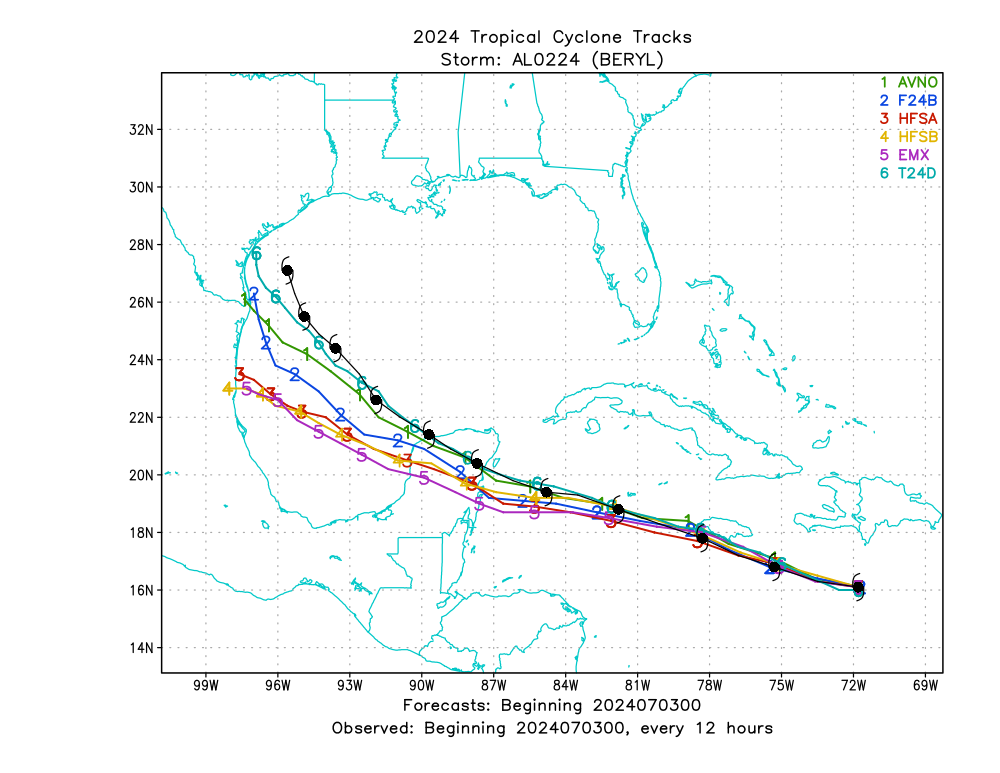
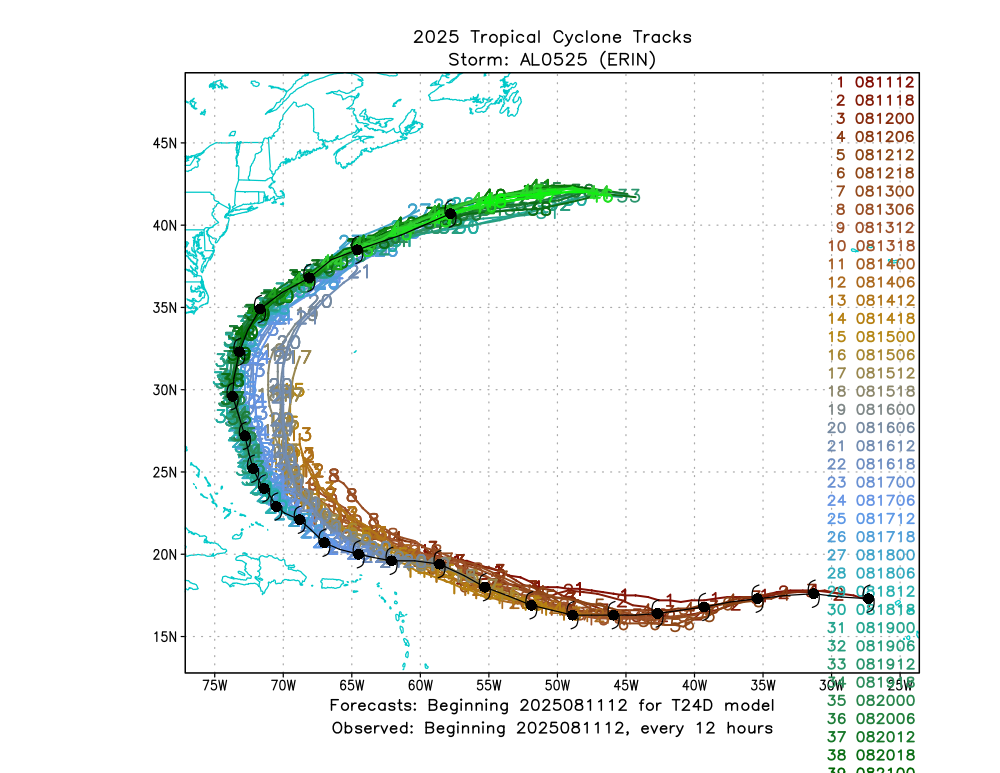
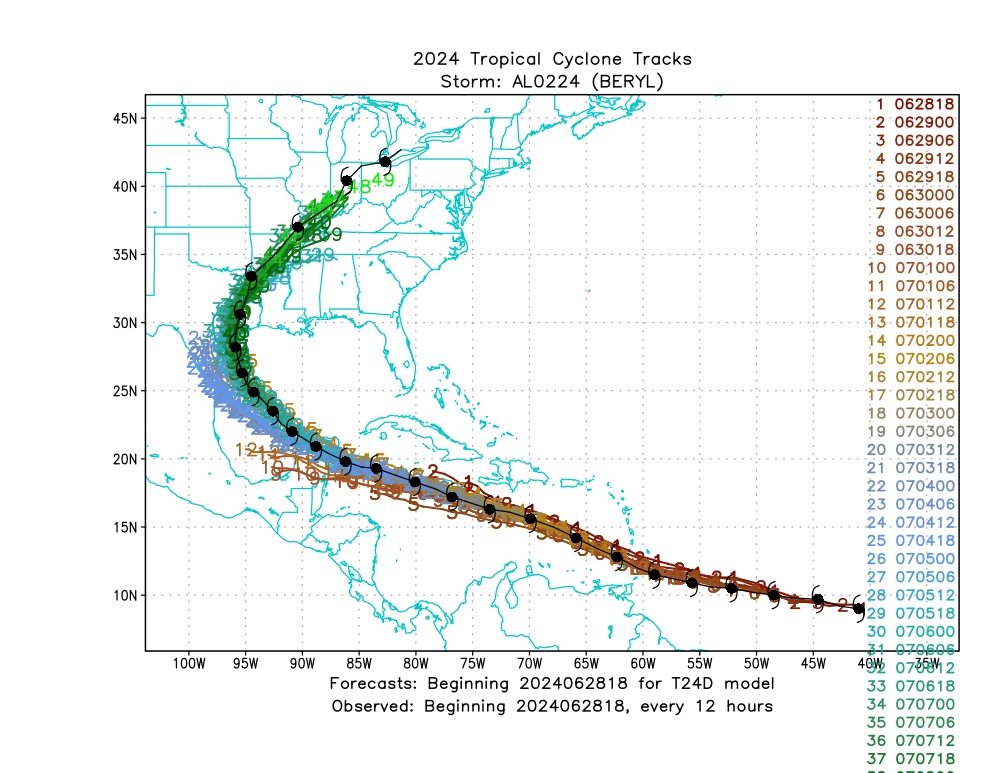
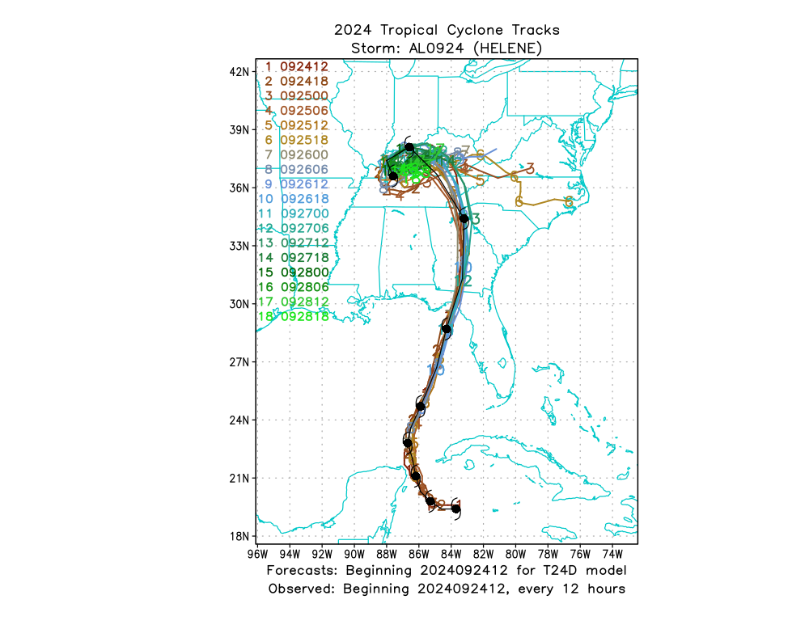

<div align="center">

# 🌀 GFDL Vortex Tracker

**Tropical cyclone tracking and diagnostics for numerical weather model output**

Developed at NOAA's Geophysical Fluid Dynamics Laboratory (GFDL)

</div>

---

The GFDL Vortex Tracker identifies and analyzes tropical cyclones in numerical weather model output — diagnosing a storm's location, intensity, and wind structure over time. It has supported National Weather Service and U.S. Navy operations for more than two decades, plays a role in NOAA's Hurricane Analysis and Forecast System (HAFS), and is the standard hurricane tracking tool within NOAA's Unified Forecast System (UFS).

> 📖 **For full installation, configuration, and troubleshooting details, see the [complete User's Guide](docs/UserGuide.md).**

## Sample Output

**Multi-model comparison** — forecasts from GFS (AVNO), SHiELD (F24B), HAFS-A (HFSA), HAFS-B (HFSB), ECMWF (EMX), and T-SHiELD (T24D) overlaid for a single initialization:

<table>
<tr>
<td align="center" width="50%">
<br>
<sub><b>Hurricane Helene (2024, AL09)</b></sub>
</td>
<td align="center" width="50%">
<br>
<sub><b>Hurricane Beryl (2024, AL02)</b></sub>
</td>
</tr>
</table>

**T-SHiELD lifecycle plots** — a single model's forecasts across multiple initialization times, color-coded by init time:

<table>
<tr>
<td align="center" width="33%">
<br>
<sub><b>Erin (2025, AL05)</b></sub>
</td>
<td align="center" width="33%">
<br>
<sub><b>Beryl (2024, AL02)</b></sub>
</td>
<td align="center" width="33%">
<br>
<sub><b>Helene (2024, AL09)</b></sub>
</td>
</tr>
</table>

## Contents

- [Sample Output](#sample-output)
- [Quick Start](#quick-start)
- [Documentation](#documentation)
- [Status](#status)

## Quick Start

### 🖥️ If you have NOAA RDHPCS access

**1. Clone the repository**
```bash
git clone https://github.com/NOAA-GFDL/GFDL-VortexTracker.git
cd GFDL-VortexTracker
```

**2. Compile** *(replace `<system>` with `gaea`, `hera`, `hercules`, `orion`, `ppan`, `ursa`, or `wcoss2`)*
```bash
cd compile
./compiletrkr.sh <system>
```

**3. Verify the build**
```bash
cd src_code
ls exec/    # should contain the compiled executables
```

**4. Fill out required config files**
```bash
cd ../../run/init_data
# edit leadtimes.txt (required) and other files as needed
# — see the User's Guide for formatting rules
```

**5. Choose your data format and edit the setup script**
```bash
cd ../scripts/netcdf      # or ../scripts/grib
# edit setup_netcdf.sh (or setup_grib.sh) with your run's settings
# NetCDF users: also edit atmos_netcdfvars.sh
```

**6. Execute**
```bash
./setup_netcdf.sh | tee run.log
```

### 💻 If you don't have NOAA RDHPCS access

There's no fully streamlined workflow yet for non-RDHPC systems. Options currently available:

| Method | Notes |
|---|---|
| **Spack** | Install dependencies locally using the spec list in the [User's Guide](docs/UserGuide.md#422-spack) as a starting point *(comprehensive instructions coming soon)* |
| **Container** | Pull the project's CI container image and build manually with `cmake` — see the [User's Guide](docs/UserGuide.md#424-containerized-environment) for steps |

> A more streamlined, user-friendly build/run workflow for non-RDHPC systems is planned for a future release.

## Documentation

| Resource | Description |
|---|---|
| 📘 [User's Guide](docs/UserGuide.md) | Full installation, configuration, running, output, and troubleshooting reference |
| 🌪️ [Genesis Detection](docs/genesisdoc.md) | Details on the tracker's genesis detection (`tcgen`) mode |
| 💨 [Wind Radii](docs/radiidoc.md) | Details on wind radii and axisymmetric RMW diagnostics |

## Status

This repository is the community version of the GFDL Vortex Tracker. NOAA RDHPCS remains the primary supported platform; support for additional environments (Spack, containers) is under active development. More comprehensive technical documentation on the tracker's internals is also in progress and expected to be published soon.

---

<div align="center">
<sub>Maintained by the Weather and Climate Dynamics Division, NOAA/GFDL</sub>
</div>